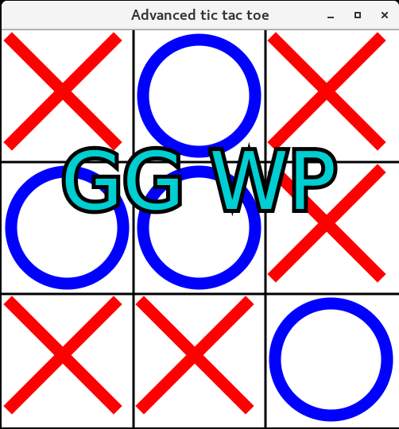

# Table of Contents

1.  [Abstract](#org6c5e5cb)
2.  [Installation](#org60ec6c5)
3.  [Instructions](#orgbd5b092)
4.  [Code notes](#org2d68e23)
    1.  [Main logic](#orgaf95629)

# Abstract

//
Very simple 'project' from 'back in the day'. It's a basic Tic-Tac-Toe game that also implements the Mini-Max algorithm for playing two-player games. 

# Installation

Just run *maven* to package the *jar* file:

    git clone https://github.com/palikar/TicTacMiniMax
    cd TicTacMiniMax
    mvn package

After that just run the jar file:

    java -jar target/tictacminimax-1.0-SNAPSHOT.jar

# Instructions

For the time being, the "human" player is the one making the first move. Just clock on the rectangles and play the game. The "computer" will make it's moves automagically. At the end of the game, a "message" will be displyed to congratulate you&#x2026;or not congratulate you, find the messages yourself!

# Code notes

## Main logic

The interesting part of the application is mostly in the *Game* class in the `Game.java` file.
//
The current state of the game is stored in the  `gameState` variable. Each time the "human" player makes a move the `makeMove` method is called with the location of the played move. Some checks are made and then the `getNextMove` move is called with the current state of the game. This is where the mini-max algorithm is performed. There is also `miniMax` method that performs the actuall recursive step. The method:

    private int miniMax(int state[][], int depth, boolean minimazing) {
      int winner = getWinner(state);
    
      if (winner == 2) {
        return Integer.MAX_VALUE - depth;
      }
      if (winner == 1) {
        return depth + Integer.MIN_VALUE;
      }
      if (isBoardFull(state)) {
        return 0;
      }
    
      if (minimazing) {
        ArrayList<int[][]> moves = getNextStates(state, 1);
        int bestSoFar = Integer.MAX_VALUE;
        for (int[][] nextMove : moves) {
          final int val = miniMax(nextMove, depth + 1, false);
          bestSoFar = Math.min(val, bestSoFar);
        }
        return bestSoFar;
      } else {
        ArrayList<int[][]> moves = getNextStates(state, 2);
        int bestSoFar = Integer.MIN_VALUE;
        for (int[][] nextMove : moves) {
          final int val = miniMax(nextMove, depth + 1, true);
    
          bestSoFar = Math.max(bestSoFar, val);
        }
        return bestSoFar;
      }
    }

Some notes:

-   `getWinner` examines the state of the game and decides wheather the winning condition is met for someone.
-   `getNextStates` generates all possible next states for a given one.

